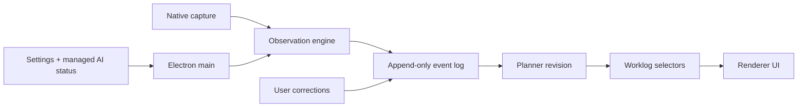

# Flow

An AI worklog for macOS. Flow passively captures screen context, turns it into structured observations, and periodically writes a planner-backed calendar of what you worked on.

Flow sits quietly in your menu bar, captures what you're working on, and keeps a local event log that can be replayed into a daily work timeline.

## Features

- **Passive context capture** -- tracks the active app, window title, and screen region without interrupting your workflow
- **Precise mode** -- uses macOS Accessibility APIs for fine-grained window metadata when granted permission
- **AI-powered observations** -- sends screenshots and metadata through a strict JSON schema to produce structured, validated observations
- **Planner revisions** -- periodically condenses recent observations into calendar blocks with notes, artifacts, confidence, and provenance
- **Guided setup** -- walks new users through Managed Flow AI, privacy, and macOS permissions before the first capture session
- **Correction workflow** -- lets users rename blocks, change categories, mark mistakes, and feed that feedback into future planning
- **Status center** -- makes capture, planner, permissions, privacy mode, managed AI, and recent activity visible at a glance
- **Local-first storage** -- the event log and planner snapshots are persisted locally in Application Support

## Requirements

- macOS 14.0+
- Node.js 22+
- pnpm
- Xcode 15+ command line tools for the native capture helper

## Getting Started

```bash
# Enable the pnpm version declared in package.json, if needed
corepack enable

# Install dependencies
pnpm install

# Configure AI. For normal users, point the app at your hosted Flow AI relay.
cp .env.example .env

# Build the native capture helper
pnpm native-capture:build

# Start the Electron app in development
pnpm electron:dev
```

For local development, `.env.example` uses `FLOW_AI_PROXY_URL=local`, which
keeps the managed-only product path while running the relay adapter inside
Electron with local provider keys. For hosted builds, replace `local` with your
Flow AI relay URL; the relay keeps Gemini/Anthropic provider keys server-side.

Local Electron runs use the `Flow Dev` profile by default. That keeps your
iterating app separate from the installed production app:

- `pnpm electron:dev` launches `Flow Dev` and stores data in
  `Application Support/Flow Dev`.
- `pnpm electron:dev:prod-data` is an explicit escape hatch for testing against
  the production `Application Support/Flow` profile.
- `pnpm electron:dist` builds the production `Flow` app.
- `pnpm electron:dist:dev` builds a packaged `Flow Dev` app with a separate app
  id and release folder.

To create a packaged macOS app directory:

```bash
pnpm electron:dist
```

On first launch, Flow opens a setup checklist for Managed Flow AI, privacy mode,
**Accessibility**, **Screen Recording**, and the first capture session. Opening
`http://127.0.0.1:5173` in a browser is only a layout preview; native capture
requires the Electron app.

## Development

```bash
pnpm native-capture:build
pnpm check
pnpm electron:build
```

More details:

- [Architecture](docs/architecture.md)
- [Benchmarking](docs/benchmarking.md)
- [Demo Data](docs/demo-data.md)
- [Privacy and Settings](docs/privacy-and-settings.md)
- [Roadmap](docs/roadmap.md)
- [Release](docs/release.md)
- [Parity QA](docs/electron-parity-qa.md)
- [Contributing](CONTRIBUTING.md)
- [Security](SECURITY.md)

## How It Works

```
Screen context -> Capture -> Observation -> Event log -> Planner -> Worklog UI
```

1. Flow monitors the frontmost application and window via macOS APIs.
2. Changed frames are captured with sanitized metadata and OCR text.
3. The observation engine returns structured JSON validated against a strict schema.
4. Observations are appended to the local event log.
5. The planner periodically rewrites the recent work window into calendar blocks.
6. Today, calendar, insights, chat, and settings screens read from the replayed timeline.

### Storage

All data stays on your machine:

| Boundary          | Contents                                                                              |
| ----------------- | ------------------------------------------------------------------------------------- |
| Event log         | Sessions, captures, observations, planner revisions, failures, notes, and corrections |
| Settings          | Onboarding state, privacy mode, managed AI status, and legacy encrypted key metadata  |
| Capture previews  | In-memory thumbnails for the current app session                                      |
| Planner snapshots | Calendar blocks derived from recent observations                                      |



## Project Structure

```
electron/
  main/                          Electron main process, IPC, storage, AI services
  preload/                       Typed window.flow bridge
  renderer/                      React DOM app
  native-capture/                macOS ScreenCaptureKit/Vision helper
src/
  observation/
    geminiObservationEngine.ts    Structured observation provider
    schema.ts                     Observation schema and validation
  planner/
    revisionEngine.ts             Planner revision engine
    providers/                    Gemini and Anthropic planner providers
    selectors.ts                  Worklog selectors over planner snapshots
    types.ts                      Plan block, snapshot, and usage types
  timeline/
    eventLog.ts                   Event types and replay logic
  worklog/
    types.ts                      Worklog block and day view types
```

## Runtime

Flow now runs as an Electron app. The shared domain model, event log replay,
planner, observation schema, chat tools, and privacy redaction remain in `src/`.
Electron owns app boot, storage IPC, AI IPC, renderer UI, packaging, and the
native macOS capture helper.

## License

MIT. See [LICENSE](LICENSE).
