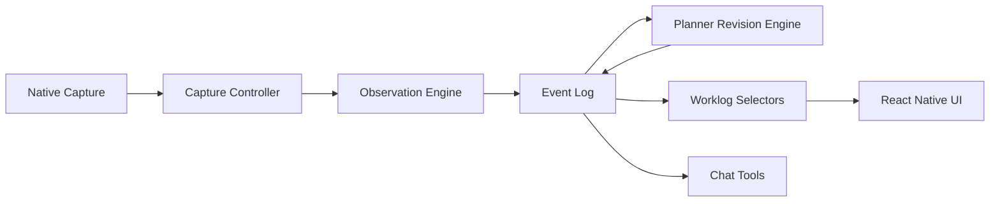

# Architecture

Flow has one runtime model: capture work context, record observations, revise the plan, and render the latest worklog.

## Domains

- `src/capture/` owns screen permissions, capture inspection, and capture commands.
- `src/observation/` owns structured observation generation and schema validation.
- `src/timeline/` owns append-only events, replay, persistence, and session orchestration.
- `src/planner/` owns planner revision prompts, model providers, cost summaries, and selectors over planner snapshots.
- `src/worklog/` owns shared worklog types consumed by planner selectors and UI.
- `src/ui/` owns React Native presentation components and product screens.

## Event Log

The persisted timeline is intentionally small. It stores session lifecycle, capture records, observations, planner revisions, planner failures, and user block-note edits. Replaying those events produces `TimelineView`, which is the single source of truth for UI selectors.

Legacy task segment, lineage, decision, retro, and reconciliation events are not part of the open-source runtime.

## Planner

The planner reads recent observations from the replayed timeline, condenses them into clusters, asks a model provider for plan blocks, normalizes the result, and appends either `task_plan_revised` or `task_plan_revision_failed`.

The UI never calls model providers directly. It reads planner snapshots through `src/planner/selectors.ts`.
