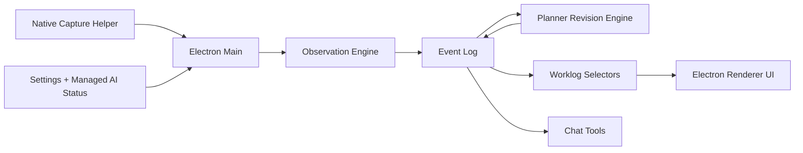

# Architecture

Flow has one runtime model: capture work context, record observations, revise the plan, and render the latest worklog.

```mermaid
flowchart LR
  nativeCapture[Native Capture Helper] --> main[Electron Main]
  settings[Settings + Managed AI Status] --> main
  main --> observation[Observation Engine]
  observation --> eventLog[Event Log]
  eventLog --> planner[Planner Revision Engine]
  planner --> eventLog
  eventLog --> worklog[Worklog Selectors]
  worklog --> ui[Electron Renderer UI]
  eventLog --> chat[Chat Tools]
```

## Domains

- `electron/native-capture/` owns screen permissions, capture inspection, screenshot capture, OCR, redaction, and hashing.
- `electron/main/` owns IPC, settings, managed AI routing, capture orchestration, planner cadence, and model calls.
- `electron/renderer/` owns presentation and user interactions.
- `src/observation/` owns structured observation generation and schema validation.
- `src/timeline/` owns append-only event types and replay.
- `src/planner/` owns planner revision prompts, model providers, cost summaries, and selectors over planner snapshots.
- `src/worklog/` owns shared worklog types consumed by planner selectors and UI.

## Event Log

The persisted timeline is intentionally small. It stores session lifecycle, capture records, observations, planner revisions, planner failures, user block-note edits, and user correction feedback. Replaying those events produces `TimelineView`, which is the single source of truth for UI selectors.

Settings are not timeline events. Onboarding state, privacy mode, managed AI
status, and legacy encrypted API-key metadata live in a separate settings file
owned by Electron main.

Legacy task segment, lineage, decision, retro, and reconciliation events are not part of the open-source runtime.

## Planner

The planner reads recent observations from the replayed timeline, condenses them into clusters, asks a model provider for plan blocks, normalizes the result, and appends either `task_plan_revised` or `task_plan_revision_failed`.

The UI never calls model providers directly. It reads planner snapshots through `src/planner/selectors.ts`. User corrections are applied by selectors at read time and passed back into future planner prompts as hints.
